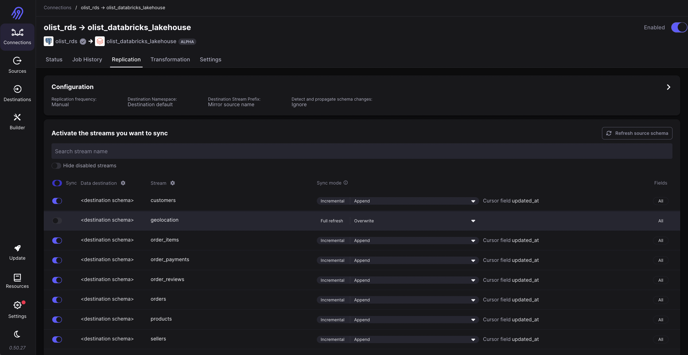

# dec-final-project

## Project Plan

### Objective
Positioning ourselves as a Brazilian E-Commerce player (Olist), the objective of this project is to automate the creation of data/tables that will help analysts, data scientists and management of the company to make better business decisions and track KPIs.

This will be done by potentially:
- Creating the neccessarry fact tables pertaining to sales and orders.
- Creating the neccessarry dimensional tables pertaining to customers, products and sellers.
- Applying dimensional modelling techniques to track inventory, lead times, as well as monthly aggregations (to be able to track the growth of the business).
- Allowing the visualisation of the aforementioned data/tables through a dashboard and running batch jobs at a daily frequency.

### Consumers
The envisioned end consumers are the analysts, data scientists and management (e.g. PMO office) of Olist, who would utilise the data to e.g. initiate continuous improvement projects, make informed business decisions based on observed growth, run pricing experiments, etc.

### Dataset
The dataset has been obtained from kaggle:
https://www.kaggle.com/datasets/olistbr/brazilian-ecommerce?select=olist_order_items_dataset.csv

The following source has been used to migrate the relevant data/tables to a psql database:
https://github.com/pauloreis-ds/olist-database-postgresql

### Solution Architecture
The proposed solution architecture is as shown by the following diagram:

### Breakdown of Tasks
The project is broken down according to the following tasks:
- Setting up a project repository.
- Create dimensional models.
- Creating an RDS instance for the Olist database and migrating data to populate it.
- Hosting Airbyte on an EC2 instance.
- Configuring extract and load batch data integrations steps using Airbyte for ingestion into Databricks Lakehouse.
- Creating databricks notebooks (bronze, silver and gold layers) for batch transform steps.
- Creating tests using Great Expectations in the transform notebooks.
- Orchestrating the notebooks using Databricks workflow.
- Create a dashboard using databricks SQL dashboards to visualise the relevant metrics/data from the fact and dim tables.
- Configuring CI/CD using Github actions for deploying to a Databricks repo.

### Data Ingestion
The initial schema of the Olist is as the following:

An `updated_at` column was added to all columns to denote the timestamp at which the record(s) for a given table was last updated.

This would act as the cursor column for an `append` sync mode.

Data quality checks were implemented using Great Expectations to ensure:
1. Keys/Columns representing the grain of the tables were not null (as this would be used for deduplication in the silver layer).
2. Tables had the updated_at timestamp (which was neccessarry for the dedupe logic in the silver layer).

Deduplication was then done in the silver layer; This was done by grouping records by their key, sorting them by their `updated_at` column and taking the latest record.

### Dimensional Models (Data Transformations)

Transformations were done to get the following fact tables required for visualisation of metrics.

### Orchestration
Orchestration was done using Databricks directly;

A workflow was created to implement a DAG for the set of bronze, silver and gold layer notebooks:

This workflow was then scheduled to run on a daily basis using a job:

### Visualisation
The visualisations for monitoring lead time and inventory metrics were carried out using Databricks Lakehouse's dashboard interface.

The visualisations shown were for:
1. Lead Times for each step of the order process (from an order being purchased, to approved, to being transferred to a carrier, to finally being delivered to the final customer).
2. A table showing the current inventory levels of SKUs, sorted from highest to lowest.
